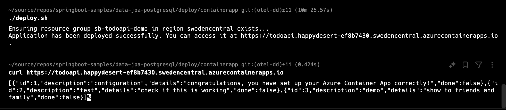
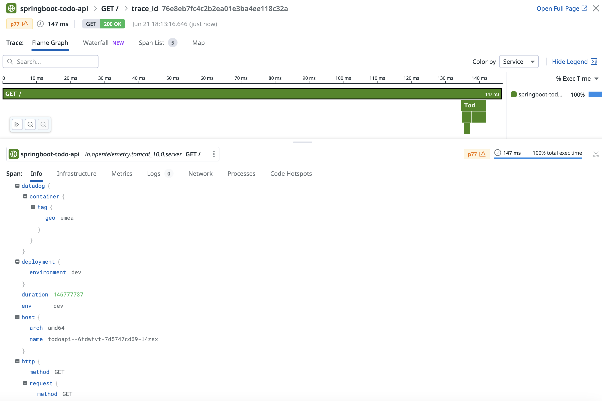

# Azure Container Apps, OpenTelemetry and Datadog

This is a sample Spring Boot 3 application that sends telemetry (traces and metrics) to Datadog using a self-hosted OpenTelemetry collector.
The main difference between this solution and existing solutions like [Datadog's Container Apps agent](https://docs.datadoghq.com/serverless/azure_container_apps/)
and the built-in [OpenTelemetry collector in Azure Container Apps](https://learn.microsoft.com/en-us/azure/container-apps/opentelemetry-agents?tabs=arm) is that this
solution propagates arbitrary [tags](https://docs.datadoghq.com/getting_started/tagging/). 


## Solution
This solution propagates [custom OpenTelemetry resource attributes](https://opentelemetry.io/docs/concepts/resources/#custom-resources) to the OpenTelemetry Collector, which is configured to map resource attributes to Datadog tags.

This capability is built into the [OpenTelemetry Collector Datadog Exporter](https://github.com/open-telemetry/opentelemetry-collector-contrib/tree/main/exporter/datadogexporter), but not well documented:

```yaml
exporters:
  datadog/exporter:
    api:
      key: ${env:DD_API_KEY}
      site: ${env:DD_SITE}
    metrics:
      resource_attributes_as_tags: true
```

## Deployment

This project contains a deyploment script to deploy the sample solution to Azure. You need:

* A Bash shell (built into macOS abd Linux, on Windows 10/11 install the [Windows Subsystem for Linux](https://learn.microsoft.com/en-us/windows/wsl/install))
* The [Azure CLI](https://learn.microsoft.com/en-us/cli/azure/get-started-with-azure-cli)
* If you don't want to install these tools on your machine, you can use the [Azure Cloud Shell](https://learn.microsoft.com/en-us/azure/cloud-shell/overview) instead, which has everything you will need preinstalled.

### First time use

If this is the first time you use the Azure CLI on your machine, log in to Azure and install Bicep. This is not required if you are using Cloud Shell.

```bash
az login
az bicep install 
```

### Setting required environment variables

The deployment script relies on a number of environment variables to deploy the application with the desired configuration.

| Env var                         | Purpose                                       | Default value   |
|---------------------------------|-----------------------------------------------|-----------------| 
| CONTAINERAPP_RESOURCE_GROUP     | Specifies the resource group to deploy to     |                 |
| CONTAINERAPP_LOCATION           | Specifies the Azure region to deploy to       | `westeurope`    |
| CONTAINERAPP_POSTGRES_LOGIN     | Specifies the PostgreSQL admin login          |                 |
| CONTAINERAPP_POSTGRES_LOGIN_PWD | Specifies the PostgreSQL admin login password |                 |
| CONTAINERAPP_DD_API_KEY         | Specifies your Datadog API key                |                 |
| CONTAINERAPP_DD_SITE            | Specifies your Datadog site                   | `datadoghq.com` |

### Deploying the sample

Open a terminal window and execute these commands:

```bash
cd <path-to-repo>/deploy/containerapp
export CONTAINERAPP_RESOURCE_GROUP='<your-resource-group>'
export CONTAINERAPP_LOCATION='<your-azure-region>'
export CONTAINERAPP_DD_API_KEY='<your-datadog-api-key>'
export CONTAINERAPP_DD_SITE='<your-datadog-site>'
export CONTAINERAPP_POSTGRES_LOGIN='springboot'
export CONTAINERAPP_POSTGRES_LOGIN_PWD="$(openssl rand -base64 12 | tr -dc 'A-Za-z0-9' | head -c 16)"
./deploy.sh
```

Once the deployment has completed, the script will display the FQDN of the application's API endpoint.
Now, you can start sending requests to that endpoint and see traces in Datadog.





## Note
This sample also contains Docker Compose files to run the application, its database, and the OpenTelemetry Collector with various APM backends&mdash;Datadog, Azure Monitor, Honeycomb, or Jaeger.
